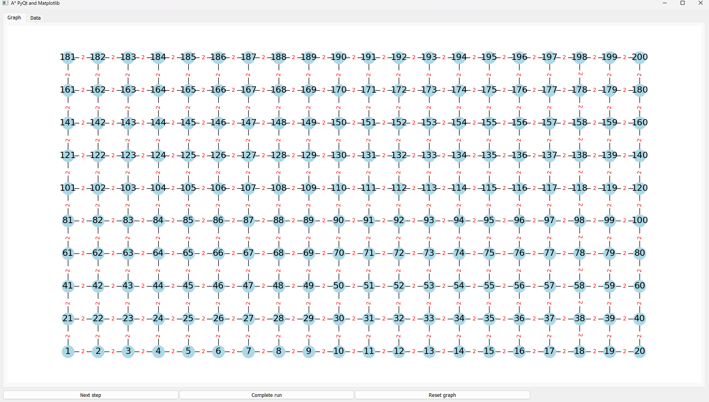

# a_star_viz

a_star_viz is a Python library for showing the A* algorithm in a pyqt application.

## TODO

- add data tab: information about the current node states (ideal path, node at top of open list heap, current path cost, ...)
- add cross connections
- highlight node on mouse hover
- hightlight current node whose information is displayed


## Starting the application

```bash
python .a_star_vis/scripts/
```


