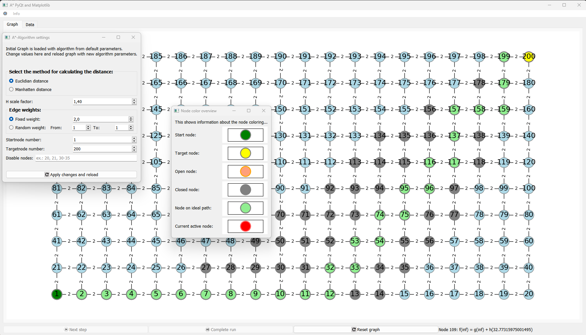

# a_star_viz

a_star_viz is a Python library for showing the A* algorithm in a pyqt application.

## TODO

- highlight node on mouse hover
- hightlight current node whose information is displayed
- add current path information, highlight ideal path

## Starting the application

```bash
python .a_star_vis/scripts/
```


